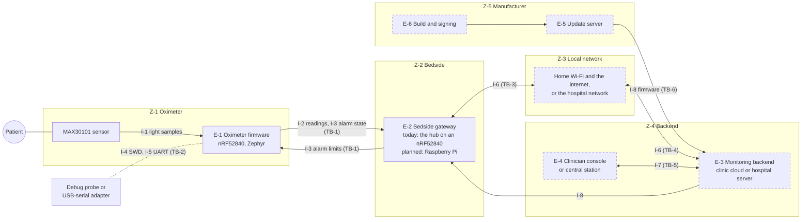

# System description

The system the threat model analyses: what it's for, where it's used, what it's made of, what's worth protecting, and who might attack it. Everything here gets an ID, so threats, controls and tests can refer back to it.

> Portfolio exercise, not a medical device: written as a manufacturer would for an FDA premarket submission, for a device that will never be sold or used on people.

## Intended use

A wireless pulse oximeter for continuous monitoring of adults' functional oxygen saturation (SpO2) and pulse rate, with alarms when either leaves limits set by a clinician. Readings and alarms go over Bluetooth LE to a bedside gateway, which forwards them to a monitoring backend where clinicians watch them and set each patient's alarm limits.

Under FDA's definition this is a **cyber device** (FD&C Act section 524B): it runs software, and its Bluetooth link counts as the ability to connect to the internet. A pulse oximeter is Class II (product code DQA).

## Use environments

The same design is deployed in two places, and the threat model analyses both.

| | Home monitoring | Hospital ward |
|---|---|---|
| Patient | at home, often alone or with family | on a ward, one oximeter per bed |
| Gateway | one, on the patient's home network | one per bed, on the hospital network |
| Network | home Wi-Fi or Ethernet, then the internet | the hospital's managed network |
| Backend | the clinic's cloud service, reached over the internet | the hospital's central station server, on site |
| Who sets alarm limits | a clinician, remotely, through the backend | a nurse, at the central station |
| Who's within radio range | family, visitors, neighbours, passers-by | other patients, visitors, staff |
| Who can touch the device | household members, visitors, whoever gets it after use | visitors, staff, other patients |
| Patients one backend serves | many homes | a ward or a hospital |

## Elements

| ID | Element | Built | Runs on | Role |
|---|---|---|---|---|
| E-1 | Oximeter | Yes (in simulation; board pending) | nRF52840, Zephyr 4.4, [app/](../../app/) | measures SpO2 and pulse, raises alarms, serves readings and alarm limits over Bluetooth |
| E-2 | Bedside gateway | Stand-in: the [hub](../../hub/) on a second nRF52840 | planned: Raspberry Pi, Linux | finds the oximeter, relays readings and alarms to the backend, and limits and updates back |
| E-3 | Monitoring backend | Planned | home: cloud service; ward: on-site server | stores readings, routes alarms to clinicians, keeps each patient's limits |
| E-4 | Clinician console | Planned | home: web application; ward: central station | where clinicians watch patients and set alarm limits |
| E-5 | Update server | Planned | manufacturer's service | distributes signed firmware for the oximeter and the gateway |
| E-6 | Build and signing environment | Partly: CI builds the firmware | manufacturer's CI and key storage | builds releases and signs them |

## Interfaces

What each interface allows **today**, in the baseline built without security controls.

| ID | Interface | Between | Carries | Today |
|---|---|---|---|---|
| I-1 | I2C bus and INT line | sensor, oximeter MCU | raw red and infrared light samples | inside the enclosure; no protection |
| I-2 | Bluetooth LE: Pulse Oximeter Service | E-1, E-2 | SpO2 and pulse readings (notified once a second) | **open**: no pairing, no encryption; anyone in range can connect, subscribe and read |
| I-3 | Bluetooth LE: alarm service | E-1, E-2 | alarm limits (read and write), alarm state (notified) | **open**: anyone in range can read the limits and **write new ones** |
| I-4 | SWD debug port | E-1, a debug probe | full read and write access to flash and RAM | **unlocked**: anyone with physical access can read or replace the firmware |
| I-5 | UART console | E-1, anything attached | log of readings, alarms and limit changes | plain text, output only |
| I-6 | Gateway to backend | E-2, E-3 | readings and alarms up; limits and updates down | planned |
| I-7 | Clinician console to backend | E-4, E-3 | patients' readings and alarms; limit changes | planned |
| I-8 | Update path | E-5 → E-3 → E-2 → E-1 | signed firmware images | **none**: firmware can only be changed through I-4 |
| I-9 | Gateway's local interfaces | E-2, its surroundings | the hub: a shell that sets limits; the Pi: network services, USB, a console | the hub's shell sets limits with no authentication |

## Assets

| ID | Asset | Why it matters | Where it lives |
|---|---|---|---|
| AS-1 | Readings (SpO2, pulse rate) | a wrong value leads to wrong care; lost readings hide a decline; they're also health data | E-1, I-2, E-2, E-3, E-4 |
| AS-2 | Alarm limits | a lowered SpO2 limit silences a hypoxia alarm | E-1, I-3, E-2, E-3, E-4 |
| AS-3 | Alarm state and its delivery | a suppressed or delayed alarm means a deteriorating patient isn't seen | E-1, I-3, E-2, E-3, E-4 |
| AS-4 | Oximeter firmware | it computes every reading and decides every alarm | E-1, I-4, I-8 |
| AS-5 | Patient-to-device association | readings shown for the wrong patient lead to the wrong patient's care, the main hazard on a ward | E-2, E-3 |
| AS-6 | Gateway software and configuration | the gateway can alter, drop or invent anything it relays | E-2 |
| AS-7 | Keys and credentials | they'll protect everything above; **none exist yet** | planned: E-1, E-2, E-3, E-6 |
| AS-8 | Security logs | the evidence of an attack, and of what a device did | planned |

## Users

| User | Environment | Interacts with |
|---|---|---|
| Patient | both | wears the oximeter; may move it between rooms or homes |
| Family or caregiver | home | sets up the gateway; may handle the oximeter |
| Clinician | home | watches readings remotely; sets alarm limits through E-4 |
| Nurse | ward | watches the central station; sets alarm limits |
| Hospital biomedical and IT staff | ward | install gateways, run the network, decommission devices |
| Manufacturer | both | builds, signs and updates firmware; handles reported vulnerabilities |

## Adversaries

The threat model assumes an attacker can do the following. None of them needs specialist equipment.

| ID | Adversary | Can reach | Capabilities |
|---|---|---|---|
| ADV-1 | Nearby radio attacker | I-2, I-3, within Bluetooth range: tens of metres, further with a directional antenna | a phone, an nRF52840 dongle or an ESP32: scan, connect, read, write, sniff, replay, inject, jam. At home: a neighbour or passer-by; on a ward: a visitor or another patient |
| ADV-2 | Physical access to a device | I-4, I-5, the sensor; at home, also the gateway | a debug probe and a USB-serial adapter: read or replace firmware, read logs, swap the sensor. Includes whoever gets a device after it's decommissioned |
| ADV-3 | Network attacker | I-6, the gateway's network services | a computer on the home network or the hospital network: intercept, alter, impersonate |
| ADV-4 | Remote attacker | E-3, E-4, E-5 from the internet | targets the cloud backend, clinician accounts and the update server |
| ADV-5 | Supply chain and insider | E-6, third-party software in every element | a flaw or backdoor in Zephyr, the Bluetooth stack or Linux packages; an insider with signing access; a malicious hospital insider |

**Assumptions.** The patient isn't trying to harm themselves through the device, though they may misuse it by accident. Attacks needing a chip laboratory, such as fault injection or decapping, are out of scope for this exercise; a real submission would say why for its chosen parts. Clinicians and nurses act in good faith, but their accounts and workstations can be compromised (ADV-4, ADV-5).

## Trust zones and boundaries

A **trust zone** groups what's under one party's control; a **trust boundary** is any place data or commands cross between zones. Every crossing is a place to check who's talking and whether what they sent can be believed.

| Zone | Contains |
|---|---|
| Z-1 Oximeter | E-1 and its sensor, inside the enclosure |
| Z-2 Bedside | E-2 |
| Z-3 Local network | the home network, or the hospital network |
| Z-4 Backend | E-3 and E-4, in the clinic's cloud or the hospital's data centre |
| Z-5 Manufacturer | E-5, E-6 |

| ID | Boundary | Crossed by | Why it's a boundary |
|---|---|---|---|
| TB-1 | The air between oximeter and gateway | I-2, I-3 | anyone in radio range shares it (ADV-1) |
| TB-2 | The oximeter's physical interfaces | I-4, I-5, I-1 | anyone holding the device can reach them (ADV-2) |
| TB-3 | Gateway to local network | I-6, I-9 | the network isn't controlled by the manufacturer (ADV-3) |
| TB-4 | Local network to backend | I-6 | at home this crosses the internet (ADV-3, ADV-4) |
| TB-5 | Clinicians to backend | I-7 | the backend must know who is changing a patient's limits (ADV-4) |
| TB-6 | Manufacturer to the field | I-8 | firmware in the field must come from the manufacturer and nowhere else (ADV-5) |

## Global system view

Every element and connection, with the trust zones as boxes: any arrow leaving a box crosses a boundary. Dashed elements aren't built yet.

## Use cases

The security use-case views (in a later document) take each of these in turn, through the device states they pass through:

| ID | Use case | Device states |
|---|---|---|
| UC-1 | Power on and connect | booting, advertising, connected |
| UC-2 | Measure and send readings | measuring, sending |
| UC-3 | Raise and clear an alarm | alarming |
| UC-4 | Set alarm limits | connected, configuring |
| UC-5 | Update firmware | updating (planned) |
| UC-6 | Decommission and reuse a device | between patients |
