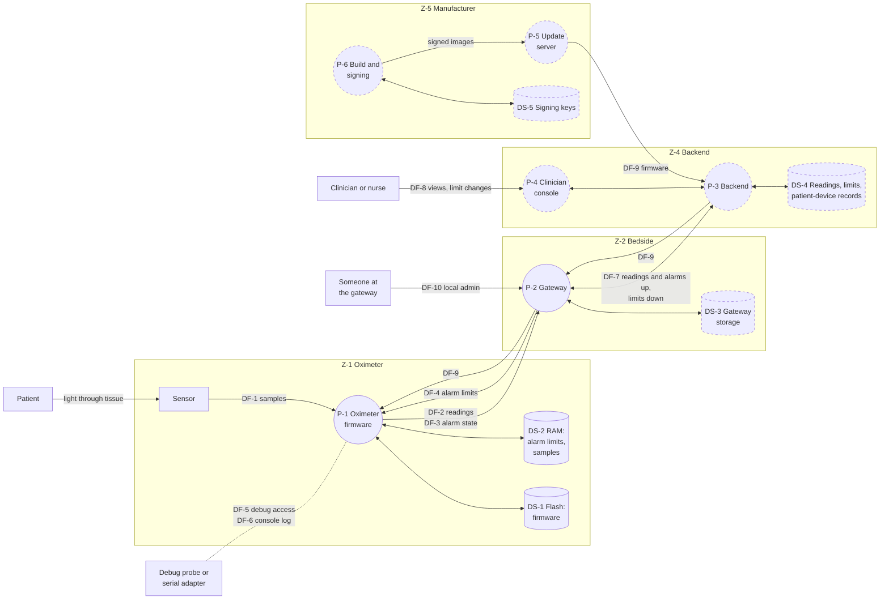

# Threat model

What could go wrong, at every element and every data flow of the system in [system.md](system.md), and what it would do to a patient. This is the baseline: the device as built in Phase 2, with no security controls. Phase 4's controls are designed against this list, and the risk assessment rates each threat's exploitability and severity.

> Portfolio exercise, not a medical device.

## Method

**STRIDE per element.** Each element of the data-flow diagram below is checked against the threat categories that apply to its kind:

| Category | Threatens | Kinds of element it applies to |
|---|---|---|
| **S**poofing | authenticity | external entities, processes |
| **T**ampering | integrity | processes, data stores, data flows |
| **R**epudiation | accountability | external entities, processes, data stores |
| **I**nformation disclosure | confidentiality | processes, data stores, data flows |
| **D**enial of service | availability | processes, data stores, data flows |
| **E**levation of privilege | authorization | processes |

STRIDE fits this system because the system is small and fully drawn: walking every element through every category leaves no element unexamined, and the coverage matrix at the end shows it. STRIDE lists threats but doesn't explore how one is carried out, so the most severe threats also get attack trees (next document).

**Scope.** Built elements are analysed against what they do today. Planned elements (the Raspberry Pi gateway, the backend, the clinician console, the update path) are analysed against their intended design, so their threats become requirements before they're built. Every threat is analysed for both use environments; where one environment changes a threat, the threat says so.

**What "Today" means.** *Exploitable* means the baseline has no control against it. *Partly mitigated* names what exists. *Not yet built* means the element is planned.

## Data flows

Processes are circles, data stores are cylinders, and each box is a trust zone: a flow leaving a box crosses a trust boundary. Dashed elements aren't built yet.

| ID | Data flow | Interface | Boundary |
|---|---|---|---|
| DF-1 | light samples, sensor to firmware | I-1 | TB-2 (physical) |
| DF-2 | SpO2 and pulse readings, oximeter to gateway | I-2 | TB-1 |
| DF-3 | alarm state, oximeter to gateway | I-3 | TB-1 |
| DF-4 | alarm limits, gateway to oximeter | I-3 | TB-1 |
| DF-5 | debug access to flash and RAM | I-4 | TB-2 |
| DF-6 | console log | I-5 | TB-2 |
| DF-7 | gateway to and from backend | I-6 | TB-3, TB-4 |
| DF-8 | clinician to console and backend | I-7 | TB-5 |
| DF-9 | firmware updates | I-8 | TB-6, then TB-4, TB-3, TB-1 |
| DF-10 | local administration of the gateway | I-9 | TB-3 or physical |

## Threats

### The alarm limits (DF-4, DS-2): the central case

| ID | STRIDE | Threat | Harm to the patient | Today | Adversary |
|---|---|---|---|---|---|
| T-01 | S | A device that isn't the patient's gateway connects and writes alarm limits, such as an SpO2 limit of 50% (AS-2) | the hypoxia alarm is silenced; a falling SpO2 goes unnoticed | **exploitable**: no pairing, no authentication on the write | ADV-1 |
| T-02 | T | A man in the middle between gateway and oximeter changes limits in transit | as T-01 | **exploitable**: no integrity protection on the link | ADV-1 |
| T-03 | T | A captured limits write is replayed later, restoring settings a clinician has since changed | as T-01, with the clinician believing their newer limits apply | **exploitable**: no freshness check | ADV-1 |
| T-04 | R | Limits change with no record of who changed them, from where, or when | an attack, or a mistaken change, can't be detected or investigated | **exploitable**: one unsigned line on the local console | ADV-1, ADV-4 |
| T-05 | I | Anyone in range reads a patient's alarm limits | discloses clinical settings; minor on its own | **exploitable** | ADV-1 |
| T-06 | T, D | Limits live only in RAM, so any reset, including an attacker pulling the battery, silently restores the defaults | the clinician's limits stop applying, and nobody is told | **exploitable** | ADV-2 |

### Readings and alarms over Bluetooth (DF-2, DF-3)

| ID | STRIDE | Threat | Harm to the patient | Today | Adversary |
|---|---|---|---|---|---|
| T-07 | I | Anyone in range subscribes to, or sniffs, a patient's readings (AS-1) | health data disclosed; a privacy harm, not a safety one | **exploitable**: open service, unencrypted link | ADV-1 |
| T-08 | S | A fake oximeter advertises the Pulse Oximeter Service and the gateway connects to it instead of the patient's | false normal readings hide a decline, or false alarms cause alarm fatigue | **exploitable**: the gateway connects to the first device advertising the service | ADV-1 |
| T-09 | T | A man in the middle alters readings or alarm state in transit | wrong values shown; an alarm suppressed | **exploitable**: no integrity protection | ADV-1 |
| T-10 | D | Radio jamming stops readings and alarms reaching the gateway | remote clinicians aren't alerted; only the oximeter's own LED still alarms | **exploitable**: the gateway logs a disconnection but raises no alarm | ADV-1 |
| T-11 | D | An attacker's device connects first and holds the oximeter's only connection | the gateway can't connect; no readings or alarms reach clinicians | **exploitable**: one connection allowed, and the oximeter stops advertising while connected | ADV-1 |
| T-12 | S, T | On a ward, a gateway connects to another bed's oximeter, by accident or by an attacker's doing (AS-5) | readings shown for the wrong patient; the wrong patient is treated | **exploitable**: the gateway can't tell oximeters apart | ADV-1 |
| T-13 | I | The oximeter's fixed address and name let anyone in range detect and follow it | reveals that someone uses a medical device, and lets them be tracked | **exploitable**: fixed address, device name in the scan response | ADV-1 |

### The oximeter (P-1, DS-1, DF-1, DF-5, DF-6)

| ID | STRIDE | Threat | Harm to the patient | Today | Adversary |
|---|---|---|---|---|---|
| T-14 | T | Malicious firmware is written through the debug port | false readings or silenced alarms, persisting through resets | **exploitable**: debug port unlocked, no secure boot | ADV-2 |
| T-15 | I | Firmware and memory are read out through the debug port | the firmware is reverse-engineered, and any keys it will hold extracted, helping attacks on every device | **exploitable**: debug port unlocked | ADV-2 |
| T-16 | T, E | A crafted Bluetooth packet exploits a bug in the firmware's handlers or the Bluetooth stack, corrupting memory or running code | anything up to full control: wrong readings, no alarms | **partly mitigated**: the firmware's own handlers check length and range, with unit tests; the stack is third-party, and nothing is fuzzed yet | ADV-1, ADV-5 |
| T-17 | D | A crash or hang stops measurement and alarms | no readings and no alarms until someone notices | **exploitable**: no watchdog, so a hang lasts until power is cycled | ADV-1 |
| T-18 | R | The oximeter records no security events: connections, limit changes, rejected writes | an attack leaves no trace on the device | **exploitable** | all |
| T-19 | T | The sensor is replaced, or false signals are injected on its bus | false readings | **exploitable** with the case open: the firmware only checks the sensor's part number | ADV-2 |
| T-20 | I | The console port logs readings and limit changes in plain text | health data readable with a serial adapter | **exploitable** | ADV-2 |

### The bedside gateway (P-2, DS-3, DF-10)

| ID | STRIDE | Threat | Harm to the patient | Today | Adversary |
|---|---|---|---|---|---|
| T-21 | S, E | Someone at the gateway changes alarm limits through its local interfaces | as T-01 | **exploitable**: the hub's shell sets limits with no login | ADV-2 |
| T-22 | T | A compromised gateway alters, drops or invents what it relays, in both directions | wrong readings, suppressed alarms, forged limits, for every patient it serves | **not yet built**; by design the gateway can see and change everything it relays | ADV-3 |
| T-23 | D | The gateway goes offline: power, network, crash | readings and alarms stop reaching clinicians, silently unless the loss is detected | **not yet built** | ADV-2, ADV-3 |
| T-24 | I | Health data is read from the gateway's storage or its network traffic | privacy harm | **not yet built** | ADV-2, ADV-3 |

### The network path and the backend (DF-7, DF-8, P-3, P-4, DS-4)

| ID | STRIDE | Threat | Harm to the patient | Today | Adversary |
|---|---|---|---|---|---|
| T-25 | S | A fake backend sends gateways limits or updates; a fake gateway sends the backend readings for a patient | forged limits; invented readings recorded as a real patient's | **not yet built** | ADV-3, ADV-4 |
| T-26 | T, I | Traffic between gateway and backend is altered or read in transit; at home it crosses the internet | as T-09 and T-07, for many patients | **not yet built** | ADV-3 |
| T-27 | S | A stolen clinician or nurse login changes patients' limits | as T-01, for every patient the account can reach | **not yet built** | ADV-4 |
| T-28 | T, E | A compromised backend changes limits, suppresses alarms or alters records across all patients | multi-patient harm | **not yet built** | ADV-4 |
| T-29 | I | The backend's database is breached | every patient's health data disclosed | **not yet built** | ADV-4 |
| T-30 | R | Limit changes and alarm acknowledgements aren't attributed to a person | as T-04, across the system | **not yet built** | ADV-4, ADV-5 |
| T-31 | D | The backend goes down | no remote alarms for any patient | **not yet built** | ADV-4 |

### Updates, signing and the supply chain (DF-9, P-5, P-6, DS-5)

| ID | STRIDE | Threat | Harm to the patient | Today | Adversary |
|---|---|---|---|---|---|
| T-32 | — | There's no way to update the oximeter in the field, so a vulnerability can't be fixed without physical access to every device (FDA's updatability objective) | known vulnerabilities stay open | **exploitable**: the debug port is the only way to change firmware | all |
| T-33 | T | A forged firmware image is pushed through the update path | every device runs the attacker's code | **not yet built** | ADV-3, ADV-4 |
| T-34 | T | An older, genuinely signed image with a known vulnerability is installed again (rollback) | reopens a fixed vulnerability | **not yet built** | ADV-3, ADV-4 |
| T-35 | S, I | The signing key is stolen or misused, so the attacker's firmware passes as the manufacturer's | as T-33 | **not yet built**: no signing key exists yet | ADV-5 |
| T-36 | T | A third-party component (Zephyr, the Bluetooth controller, the gateway's Linux packages) has a vulnerability or a planted flaw, as in SweynTooth (2020) | depends on the flaw: up to T-16 | **partly mitigated**: Zephyr is pinned to a release; there's no SBOM or vulnerability monitoring yet | ADV-5 |
| T-37 | I | A device passed to a new patient, or discarded, still holds the last patient's pairings, keys or settings | privacy harm; a stale pairing lets the old gateway connect | **partly mitigated**: today nothing is stored across a reset (see T-06) | ADV-2 |

## Coverage

Every element and data flow against every STRIDE category that applies to its kind. A dash marks a category that applies but where no credible threat was found, with the reason below the table.

| Element | S | T | R | I | D | E |
|---|---|---|---|---|---|---|
| Patient (external) | n/a¹ | | — | | | |
| Clinician or nurse (external) | T-27 | | T-30 | | | |
| P-1 Oximeter firmware | T-08 | T-14, T-16 | T-18 | T-15 | T-17 | T-16 |
| P-2 Gateway | T-12, T-21 | T-22 | T-04 | T-24 | T-23 | T-21 |
| P-3 Backend | T-25 | T-28 | T-30 | T-29 | T-31 | T-28 |
| P-4 Clinician console | T-27 | T-28 | T-30 | T-29 | T-31 | T-27² |
| P-5 Update server | T-25 | T-33, T-34 | — | — | T-32 | T-35 |
| P-6 Build and signing | T-35 | T-36 | — | T-35 | — | T-35 |
| DS-1 Flash (firmware) | | T-14 | T-18 | T-15 | T-17 | |
| DS-2 RAM (limits, samples) | | T-06 | T-04 | T-05 | T-06 | |
| DS-3 Gateway storage | | T-22 | T-04 | T-24 | T-23 | |
| DS-4 Backend database | | T-28 | T-30 | T-29 | T-31 | |
| DS-5 Signing keys | | T-35 | — | T-35 | — | |
| DF-1 Sensor samples | | T-19 | | — | — | |
| DF-2, DF-3 Readings, alarm state | | T-09 | | T-07, T-13 | T-10, T-11 | |
| DF-4 Alarm limits | | T-01, T-02, T-03 | | T-05 | T-11 | |
| DF-5, DF-6 Debug, console | | T-14 | | T-15, T-20 | — | |
| DF-7 Gateway to backend | | T-26 | | T-26 | T-23, T-31 | |
| DF-8 Clinician to backend | | T-27 | | T-29 | T-31 | |
| DF-9 Firmware updates | | T-33, T-34 | | — | T-32 | |
| DF-10 Gateway local admin | | T-21 | | — | — | |
| Decommissioning (UC-6) | | | | T-37 | | |

¹ The patient isn't treated as an adversary (system.md, assumptions); their accidental misuse belongs in the safety risk analysis.
² An account that can change limits for more patients than it should is an elevation of privilege within the console.

Why each dash is there:

- **Patient, repudiation:** nobody needs to be held accountable for wearing the device.
- **Update server, build environment and signing keys, repudiation:** they log their own operations; that's a Phase 4 requirement rather than a separate threat.
- **Update server and firmware updates, disclosure:** the images are signed, not secret, and carry no patient data.
- **Build environment and signing keys, denial of service:** an outage or the loss of the keys delays releases but doesn't touch devices in the field. Key backup is a Phase 4 requirement.
- **Sensor samples, disclosure and denial of service:** raw light samples identify no one, and the bus can only be cut by opening the case, which T-19 covers.
- **Debug and console ports, gateway local admin, denial of service:** none is needed for normal operation, so blocking one harms nothing.
- **Gateway local admin, disclosure:** the commands carry no patient data.

## What stands out

- **One unauthenticated write silences the alarm that matters most** (T-01 to T-03, T-21). A 50% SpO2 limit is a valid setting, so range checks can't stop it: only knowing who sent the write can.
- **The gateway trusts any oximeter, and on a ward that becomes a patient mix-up** (T-08, T-12): device identity is as much a safety control as a security one.
- **Loss of the link is silent** (T-10, T-11, T-23). The design needs a technical alarm when readings stop arriving, at the gateway and at the backend, so a jammed or hijacked link shows up as an alarm rather than as quiet.
- **The device can't be patched** (T-32), and its firmware can be read and replaced by anyone holding it (T-14, T-15): secure boot, a signed update path and a locked debug port come together.
- **Nothing is logged** (T-04, T-18, T-30), so none of the above would be noticed after the fact.
